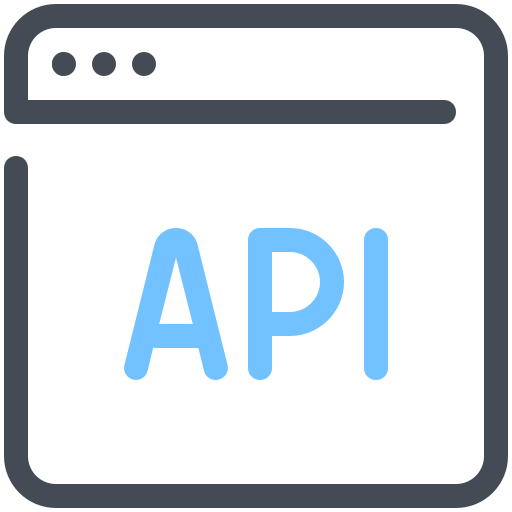
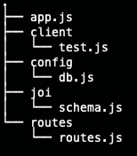
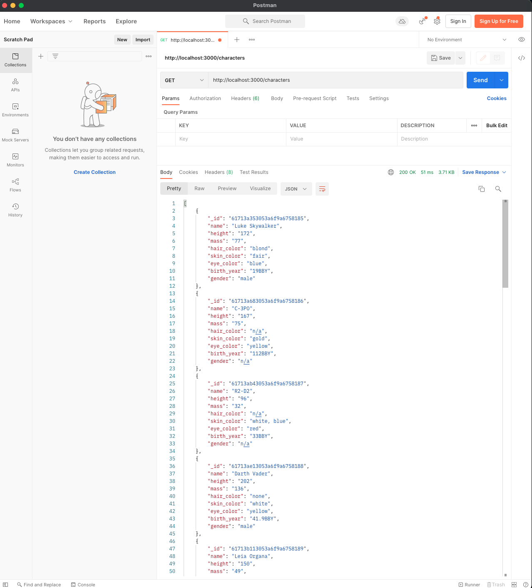
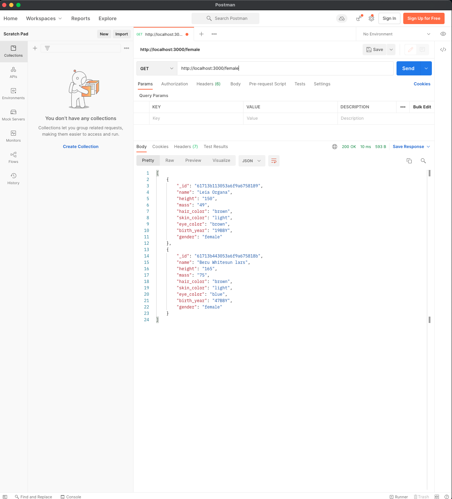
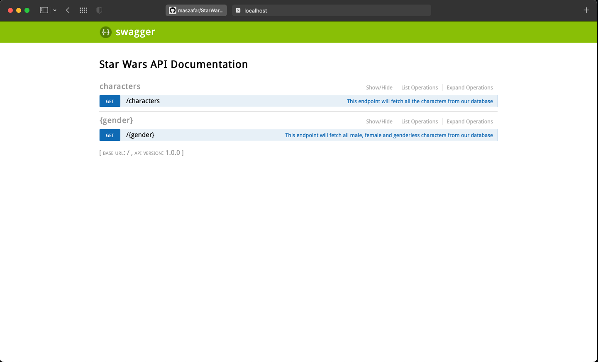

# StarWarsAPI



An API built in Node.js. It provides the user with Star Wars characters.

* **GET** Retrieve character info from the database.
* **GET** Retrieve character info based on their gender from the database.


## Technologies used in this project:


<br />

## Getting started:

Below we have the **directory tree** of the project.

<p align="center">
  
</p>

Make sure you have **mongodb** installed on your system. You can create a database and fill it with data related to characters based on the scheme provided in **config/db**. Move to the 
project directory **/StarWarsAPI/** using your terminal. Now make sure you first install the dependencies.

```shell
npm install
```

Now move to the src folder **/StarWarsAPI/src/** and run the project using **nodemon** if you have it installed.

```shell
nodemon app.js

OR

node app

```

---

Below you can see the result of a get request to the server using route **/characters**

<p align="center">
  
</p>

Similarly using the dynamic route  **/{gender}** we can search the database based on the gender of characters. In the example below we searched for female characters.

<p align="center">
  
</p>

The swagger documentation of our API can be visied under **http://localhost:3000/documentation** route. 

<p align="center">
  
</p>

<br />

## Note

Feel free to download the project and build upon it. Happy coding!
